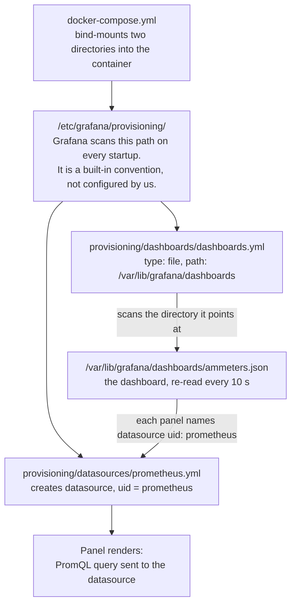
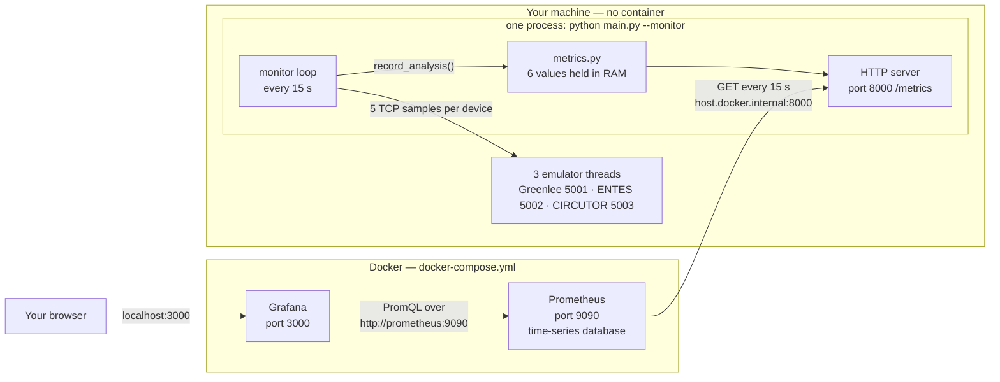
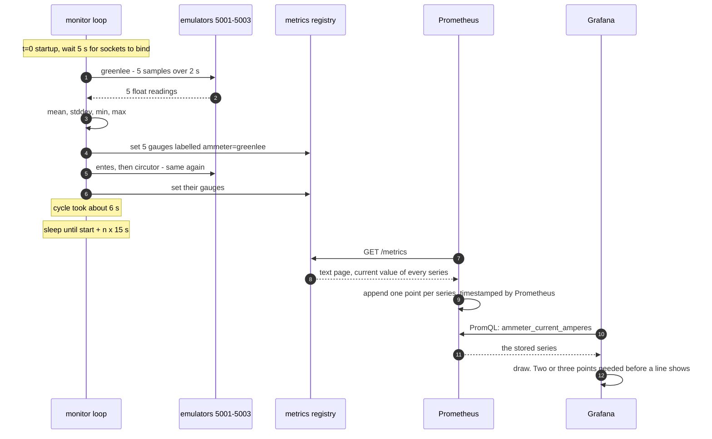

# Monitoring — how the pieces fit together

How `python main.py --monitor`, Prometheus and Grafana connect, what each new file does, and
why the dashboard appears by itself instead of being clicked together panel by panel.

For *running* it, see [README → Continuous monitoring](README.md#continuous-monitoring).
For *why it was built this way*, see
[IMPLEMENTATION_NOTES → Supporting work — observability](IMPLEMENTATION_NOTES.md).

---

## The one idea everything else follows from: it is a *pull* system

Nothing is ever sent to Prometheus. The Python process holds its numbers in memory and
publishes them as a text page at `http://localhost:8000/metrics`. **Prometheus reaches out
and fetches that page on a timer**, and only then does the data exist in a database.
Grafana never touches the Python process at all — it asks Prometheus.

So the direction of the arrows is the opposite of what "export data to Prometheus" suggests:

```
main.py  ←── HTTP GET ── Prometheus  ←── PromQL query ── Grafana  ←── HTTP ── your browser
 (holds the                 (stores the                (draws it)
  latest value)              history)
```

Three consequences worth knowing:

- **The app keeps no history.** A gauge is a single float in RAM. Restart the app and the
  current values reset — but Prometheus keeps everything it already scraped.
- **The app does not care whether anyone is watching.** With Docker down, `--monitor` runs
  fine and serves a page nobody reads. Nothing breaks, nothing queues up.
- **Prometheus decides the resolution**, not the app. If the loop runs every 15 s but
  Prometheus scrapes every 60 s, three cycles out of four are simply never recorded.

---

## What each file does

`.md` files omitted. Two of these were modified; the rest are new.

### The Python side — runs on your machine

| File | Purpose |
| --- | --- |
| `main.py` *(modified)* | Adds `--monitor` and `--interval`. The `monitor()` function is the loop: run a test on each device, hand the statistics to `metrics.py`, sleep until the next tick. It imports `prometheus_client` *inside* the function, so a plain `python main.py` still works with the package uninstalled. |
| `src/observability/__init__.py` | Empty file that makes the directory a Python package, so `from src.observability import metrics` resolves. |
| `src/observability/metrics.py` | The only file that imports `prometheus_client`. Declares the six metrics, holds their current values in memory, and starts the background HTTP server that serves `/metrics` on port 8000. |
| `requirements.txt` *(modified)* | Adds `prometheus-client`. Listed as an optional dependency — only `--monitor` needs it. |

### The Docker side — the two containers

| File | Purpose |
| --- | --- |
| `docker-compose.yml` | Defines the Prometheus and Grafana containers, publishes their ports (9090, 3000), and mounts the four config files below into them from your repo. Also maps `host.docker.internal` so a container can reach your Python process. |
| `monitoring/prometheus.yml` | Prometheus's own config, mounted to `/etc/prometheus/prometheus.yml`. Says *what to scrape* (`host.docker.internal:8000`) and *how often* (every 15 s). |
| `monitoring/grafana/provisioning/datasources/prometheus.yml` | Creates the Prometheus datasource at Grafana startup, with a fixed `uid: prometheus`. Without this you would add the datasource by hand in the UI. |
| `monitoring/grafana/provisioning/dashboards/dashboards.yml` | **The instruction you asked about.** Tells Grafana: "scan the directory `/var/lib/grafana/dashboards` and import every dashboard JSON you find there." |
| `monitoring/grafana/dashboards/ammeters.json` | The dashboard itself — five panels, each carrying a PromQL query and the datasource `uid` to run it against. This is the file the provider above loads. |

---

## How Grafana finds and loads the dashboard

This is the chain that replaces clicking panels together. Four links, and if any one breaks
the dashboard silently does not appear.



Step by step:

1. **`docker-compose.yml` mounts two host directories into the Grafana container**, one for
   provisioning config and one for the dashboard JSON:
   ```yaml
   - ./monitoring/grafana/provisioning:/etc/grafana/provisioning:ro
   - ./monitoring/grafana/dashboards:/var/lib/grafana/dashboards:ro
   ```
2. **Grafana reads `/etc/grafana/provisioning/` on startup.** That path is baked into the
   image (`GF_PATHS_PROVISIONING`); we do not tell it to look there. Inside, it treats the
   `datasources/` and `dashboards/` subdirectories as known slots and reads every YAML file
   in them.
3. **`provisioning/dashboards/dashboards.yml` is a *dashboard provider*, not a dashboard.**
   It contains no panels. It is the pointer that says where the dashboards live:
   ```yaml
   providers:
     - name: ammeters
       type: file
       options:
         path: /var/lib/grafana/dashboards      # the container path from step 1
   ```
4. **Grafana imports every `*.json` in that directory** — here, `ammeters.json` — and
   re-scans it **every 10 seconds**, so editing the JSON on your machine updates the live
   dashboard without restarting anything.

**The link between dashboard and datasource is the `uid`.** Every panel in `ammeters.json`
carries `"datasource": {"type": "prometheus", "uid": "prometheus"}`, and the datasource file
pins `uid: prometheus`. Grafana normally generates a random uid, which is why an exported
dashboard often lands with "Datasource not found" — pinning it is what makes the JSON
portable to any machine that runs this compose file.

> **Gotcha:** a provisioned dashboard is read-only in the UI. Editing a panel and pressing
> Save gives "cannot save provisioned dashboard". Edit `ammeters.json` instead — or tinker in
> the UI, then use *Dashboard settings → JSON Model* to copy the result back into the file.
> (Adding `allowUiUpdates: true` to `dashboards.yml` lifts the restriction.)

---

## The whole system

Python on the host, the two services in Docker, and every arrow pointing the way traffic
actually flows.



Two networking details that trip people up:

- **`host.docker.internal:8000`** — from inside a container, `localhost` means *the
  container itself*, so Prometheus cannot use it to reach your Python process. Docker Desktop
  provides `host.docker.internal` as "the machine running Docker"; on Linux it does not exist
  by default, which is why the compose file adds `extra_hosts: host.docker.internal:host-gateway`.
- **`http://prometheus:9090`** — Grafana talks to Prometheus by *service name* over the
  compose network, not through the published port. Both containers are on the same network,
  so `9090` is reachable between them even if you removed the `ports:` line.

---

## One cycle, second by second

Where the ~45 s before the first line appears on a graph actually goes.



The gauges are overwritten every cycle and never accumulate — whatever the last completed
cycle produced is what a scrape sees. Prometheus is what turns those snapshots into history.

Because the loop and the scrape both run at 15 s and are not synchronised, they drift in and
out of phase, so occasionally a scrape catches the same cycle twice or misses one. If you
need every cycle recorded, scrape faster than you sample — `scrape_interval: 5s` in
`monitoring/prometheus.yml`.

---

## The six metrics

All labelled by `ammeter`, so one query returns three lines — one per device.

| Metric | Type | Meaning |
| --- | --- | --- |
| `ammeter_current_amperes` | gauge | Mean current of the last cycle |
| `ammeter_current_stddev_amperes` | gauge | Sample standard deviation |
| `ammeter_current_min_amperes` | gauge | Lowest reading |
| `ammeter_current_max_amperes` | gauge | Highest reading |
| `ammeter_sample_count` | gauge | Samples collected, normally 5 |
| `ammeter_errors_total` | counter | Cycles that failed for this device |

**Gauge vs counter:** a gauge goes up and down and you read it directly. A counter only ever
increases, so you almost never plot it raw — you plot its *rate*, which is why the failure
panel queries `rate(ammeter_errors_total[5m]) * 60` rather than the counter itself.

The error counters are deliberately touched at startup so all three series exist at zero.
Otherwise a label only appears after its first failure, and the panel would read "No data"
when everything is healthy — indistinguishable from a broken query.

---

## Reading the dashboard

- **The y-axis is logarithmic** on the three current panels. CIRCUTOR reads ~0.03 A while
  ENTES reads ~66 A; on a linear axis the two small devices are flat against zero. Log scale
  is why the panel shows `10 mA … 1 kA` rather than a normal range.
- **Flat lines are correct.** "Samples per cycle" sits at 5 and "Failed cycles per minute"
  at 0 whenever everything works. They are there to make a break visible, not to wiggle.
- **Gaps in the graph** are periods when `--monitor` was not running. Prometheus records
  nothing when a scrape fails, so the line stops rather than flatlining.

---

## Limitations of this setup

Deliberate, for a local demo stack — worth knowing before you rely on it.

- **Prometheus data is not persisted.** No volume is declared, so its database lives in the
  container's writable layer: `docker compose down` deletes the history, and
  `docker compose stop` / `start` keeps it. Add a volume if you want it to survive:
  ```yaml
      volumes:
        - prometheus-data:/prometheus      # plus a top-level `volumes: {prometheus-data:}`
  ```
- **Grafana is wide open** — anonymous access with Admin rights, no login. Fine on
  `localhost`, never on anything reachable.
- **No alerting and no Pushgateway.** The Pushgateway exists for jobs too short-lived to be
  scraped; `--monitor` stays up, so Prometheus scrapes it directly and the extra hop would
  add nothing but stale data.
- **Monitor mode does not archive runs.** No JSON, no PNG, nothing under `results/`. At one
  cycle every 15 s that would grow without bound, so Prometheus is the store in this mode.
  A plain `python main.py` archives exactly as it always has.

---

## Commands

```sh
docker compose up -d          # start Prometheus + Grafana
python main.py --monitor      # start the app  (Ctrl-C to stop)

docker compose logs -f prometheus     # why a scrape is failing
docker compose restart grafana        # after editing a provisioning YAML
docker compose down                   # stop everything, discard the metric history
```

| What to check | Where |
| --- | --- |
| Is the app exporting? | http://localhost:8000/metrics |
| Is Prometheus reaching it? | http://localhost:9090/targets — the `ammeters` job must read **UP** |
| Is the data stored? | http://localhost:9090/graph — query `ammeter_current_amperes` |
| The dashboard | http://localhost:3000 → Dashboards → *Ammeter Monitoring* |

Checking them in that order isolates a fault to one link in the chain: app → scrape → store
→ draw.
