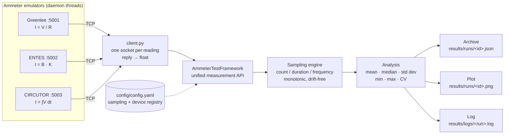

# Ammeter Testing Framework

A test framework for three emulated ammeters — **Greenlee**, **ENTES** and **CIRCUTOR**.
Each emulator is a TCP server that answers a device-specific text command with one current
reading in amperes. The framework talks to all three through a single API, samples them on
a configurable schedule, computes statistics over the samples, archives every run under a
unique ID, plots the measurement series, and ranks the devices by relative variability.

Standard library throughout, apart from `pyyaml` (config) and `matplotlib` (the plot).

---

## Quick start

Requires **Python 3.10+** (the code uses `list[X]` and `X | None` annotations).

```sh
pip install -r requirements.txt
python main.py            # run from the repository root
```

`main.py` starts the three emulators on daemon threads, runs one test per device from
`config/config.yaml`, archives each run, prints its statistics, and closes with the
comparison table:

```
CircutorAmmeter is running on port 5003
GreenleeAmmeter is running on port 5001
EntesAmmeter is running on port 5002

greenlee - 5 sample(s)
  mean     0.0447466 A
  median   0.0310724 A
  std dev  0.0432712 A
  min      0.0150893 A
  max      0.119951 A
Saved greenlee measurement series plot: C:\...\results\runs\95b21bb1-....png
esults
uns\95b21bb1-....png

[ the same block for entes and circutor ]

PRECISION COMPARISON
Ammeter    Samples     Mean (A)     Std Dev     CV (%)
--------------------------------------------------------
entes      5           62.782       34.7619     55.37
circutor   5           0.0319497    0.022056    69.03
greenlee   5           0.0447466    0.0432712   96.70
```

Real output from a run on 2026-08-23, elided where it repeats. The startup lines arrive in
whatever order the three threads bind, the readings are random by design, and the plot path
is absolute.

Using the framework directly:

```python
from src.testing.test_framework import AmmeterTestFramework
from src.testing.result_manager import save_test_run, list_test_runs, compare_test_runs
from src.testing.visualization import plot_measurement_series

framework = AmmeterTestFramework()          # reads config/config.yaml
result = framework.run_test("greenlee")     # samples, analyses, returns TestRunResult

print(result.analysis)                      # mean / median / std dev / min / max
save_test_run(result)                       # results/runs/<test_id>.json
plot_measurement_series(result)             # results/runs/<test_id>.png

list_test_runs()                            # every archived run, oldest first
compare_test_runs([id_a, id_b])             # side-by-side table of archived stats
```

---

## Architecture



| Component | File | Responsibility |
| --- | --- | --- |
| Emulator base | `Ammeters/base_ammeter.py` | Bind, accept loop, match command, reply with a reading |
| Emulators | `Ammeters/{Greenlee,Entes,Circutor}_Ammeter.py` | Per-device physics model |
| Client | `Ammeters/client.py` | One TCP request → parsed `float`, timeout, typed errors |
| Framework | `src/testing/test_framework.py` | Sampling schedule, statistics, precision comparison |
| Data types | `src/testing/models.py` | `Measurement`, `SamplingConfig`, `AnalysisResult`, `TestRunResult`, … (frozen dataclasses) |
| Archive | `src/testing/result_manager.py` | Save / load / list / compare runs as JSON |
| Plot | `src/testing/visualization.py` | One measurement-series PNG per run |
| Logging | `src/utils/logger.py` | One log file per run under `results/logs/` |

### Devices

| Ammeter | Port | Command | Model | Typical range |
| --- | --- | --- | --- | --- |
| Greenlee | 5001 | `MEASURE_GREENLEE -get_measurement` | Ohm's law, `I = V / R` | ~0.01–100 A |
| ENTES | 5002 | `MEASURE_ENTES -get_data` | Hall effect, `I = B · K` | ~5–200 A |
| CIRCUTOR | 5003 | `MEASURE_CIRCUTOR -get_measurement -current` | Rogowski coil, `I = Σ V·Δt` | ~0.005–0.05 A |

Adding a fourth device is a `config.yaml` entry plus an emulator subclass — no framework change.

---

## Configuration — `config/config.yaml`

```yaml
testing:
  sampling:
    measurements_count: 5
    total_duration_seconds: 2
    sampling_frequency_hz: 2

ammeters:
  greenlee:
    port: 5001
    command: "MEASURE_GREENLEE -get_measurement"
  # entes, circutor …
```

The three sampling parameters are over-determined, so instead of a precedence rule:

- **Give any two** — the third is derived (`count = duration × frequency + 1`).
- **Give all three** — they must agree, or the run is rejected as inconsistent.
- **Give fewer than two** — rejected.
- A derived count is floored to whole intervals and the duration recomputed, so the
  resolved config always describes the run that actually happened.

Timing uses a monotonic clock with each sample targeting `start + index × period`, so error
does not accumulate across a run.

---

## Results

Every run is written under `results/`, keyed by its UUID `test_id`:

| Path | Contents |
| --- | --- |
| `results/runs/<test_id>.json` | The whole run: metadata, resolved sampling config, every raw sample, the statistics |
| `results/runs/<test_id>.png` | Measured current against sample timestamp |
| `results/logs/<time>_<device>_<id>.log` | That run's log, DEBUG detail per sample |

### Reading past runs

`main.py` takes three options that read the archive back. They only open files — no
emulator is started and there is no startup wait:

```sh
python main.py --list                     # every archived run, oldest first
python main.py --show <test_id>           # one run: metadata, statistics, raw samples
python main.py --compare <id_a> <id_b>    # archived runs side by side
```

`--list` prints the full `test_id` of each run, which is what `--show` and `--compare`
take. An unknown or unreadable ID exits non-zero with a single-line error.

```
$ python main.py --list
f04f3be2-9133-41ee-91b5-726603f3a265  greenlee   2026-08-22 22:39:14 UTC  5 sample(s)  mean 0.601849 A
bce85dcb-c379-4c2e-9552-bd3dec398931  entes      2026-08-22 22:39:16 UTC  5 sample(s)  mean 65.3259 A
```

Running `main.py` with no options behaves exactly as before.

`results/runs/` and `results/logs/` are machine-written and gitignored. Three **curated
sample runs** — one per device, raw samples + statistics + metadata + plot — are committed
under [`results/samples/`](results/samples):

| Device | JSON | Plot |
| --- | --- | --- |
| Greenlee | [`fd05d27b….json`](results/samples/fd05d27b-e7ed-4c8d-91ac-6a2333e20898.json) | [`fd05d27b….png`](results/samples/fd05d27b-e7ed-4c8d-91ac-6a2333e20898.png) |
| ENTES | [`2b296839….json`](results/samples/2b296839-3a2d-4e4e-a397-f71c38b0d67b.json) | [`2b296839….png`](results/samples/2b296839-3a2d-4e4e-a397-f71c38b0d67b.png) |
| CIRCUTOR | [`03e43979….json`](results/samples/03e43979-403b-42d4-b1b7-3cec4f1fb23e.json) | [`03e43979….png`](results/samples/03e43979-403b-42d4-b1b7-3cec4f1fb23e.png) |

[`scripts/clean.py`](scripts/clean.py) clears the artefacts again — caches, coverage output
and the run logs:

```sh
python scripts/clean.py -n        # list what would go, delete nothing
python scripts/clean.py           # caches, coverage output, results/logs/
python scripts/clean.py --runs    # also the run archive under results/runs/
```

The archive is opt-in because it is data, not build output. `results/samples/` is never
touched, and `git clean -Xdf` is not the equivalent here: `.gitignore` also covers `.venv/`
and the assignment PDF.

---

## Key design decisions

Full reasoning, every bug fixed and every rejected alternative are in
[`IMPLEMENTATION_NOTES.md`](IMPLEMENTATION_NOTES.md); bugs are tracked by ID in
[`ISSUES.md`](ISSUES.md). The short version:

- **One result type, one error family.** Every device returns a `Measurement`; every
  failure is an `AmmeterError` (`AmmeterConnectionError` vs `AmmeterResponseError`). The
  supplied client printed the reading and returned `None` — it could not be used as an API.
- **Config-driven registry.** Device name, port and command live in `config.yaml`, so the
  framework never hard-codes a device and `main.py` iterates the registry.
- **Frozen dataclasses.** A sample records something that already happened; nothing
  downstream can edit a reading after capture.
- **Failure policy split by kind.** A bad *reply* skips that sample and the run continues;
  an unreachable *device* aborts that device's run, and `main.py` still tests the others.
- **Statistics never span devices.** The three emulators read orders of magnitude apart, so
  `analyze_measurements` rejects a mixed-device list. Values print to six significant
  figures, since `%.2f` renders every CIRCUTOR statistic as `0.01`.
- **Paths resolved from the project root**, not the working directory, so the archive and
  the logs cannot fork into a second tree beside the caller.
- **Plots via the `Agg` backend**, so figures are written headlessly (CI, no display).
- **Precision, not accuracy** — see the limitation below.

---

## Main limitation: variability is not accuracy

The comparison table ranks the **coefficient of variation** (`stdev / |mean|`), and that is
deliberately *not* a statement about which ammeter is correct:

- The emulators share **no reference current**. There is no ground truth in this system, so
  any "accuracy" figure would be measured against an invented one.
- Each emulator **redraws its physical parameters on every call**. Consecutive samples are
  independent draws from the device's model, not repeated reads of one steady current — so
  the spread measures *model variability*, not instrument repeatability.
- The devices read three orders of magnitude apart, which is why the CV is used at all: a
  raw standard deviation would rank them by magnitude.
- A CV over few samples is itself unstable, and the ordering it produces can invert between
  runs.

The report prints these caveats alongside the table so the numbers cannot be read bare.
Quantifying true accuracy would require the emulators to expose a shared reference current.

---

## Dependencies

| Package | Why |
| --- | --- |
| `pyyaml` | Reads `config/config.yaml` (supplied dependency) |
| `matplotlib` | The per-run measurement-series plot — the only dependency this project added |
| `pytest`, `pytest-cov` | Test suite and coverage gate (test-only) |

Everything else is standard library: `socket`, `statistics`, `json`, `pathlib`, `logging`,
`threading`, `dataclasses`, `uuid`. `requirements.txt` still lists `numpy`, `scipy`,
`seaborn` and `pandas`, inherited from the supplied file and imported nowhere; removing them
is tracked as ISS-21.

---

## Tests and CI

```sh
python -m pytest                                    # suite under tests/
python -m pytest --cov=src --cov-fail-under=85      # with the coverage gate
```

[`.github/workflows/ci.yml`](.github/workflows/ci.yml) runs on every pull request against
`master`: byte-compile, import every module, then `pytest` with coverage as a blocking gate
(85% floor, currently ~98% of `src/`).

### Workflow

Nothing is committed to `master` directly. Branch (`feature/`, `fix/`, `chore/`,
`refactor/`, `test/`) → push → PR → green CI → merge → delete the branch in both places.

### Known gaps

- `examples/run_tests.py` is the supplied stub and still does not run (ISS-06) — use
  `main.py` or the framework API above.
- Emulators have no clean shutdown and no `SO_REUSEADDR`; the process relies on daemon
  threads (ISS-10, ISS-18).
- Prometheus/Grafana observability is planned in [`ROADMAP.md`](ROADMAP.md) but **not
  implemented** — no metrics are exported.
